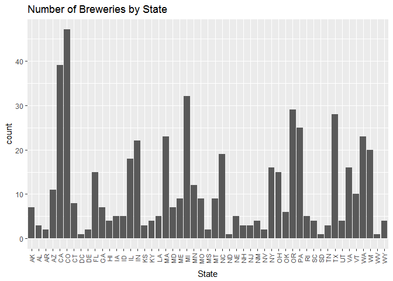
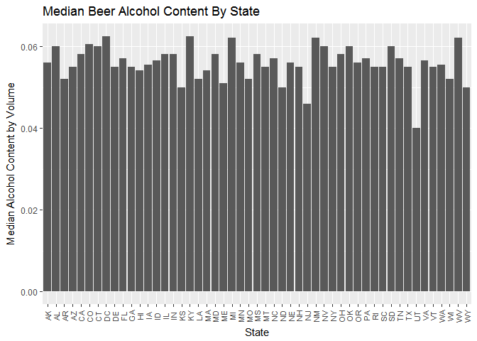
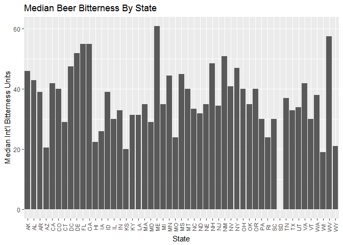
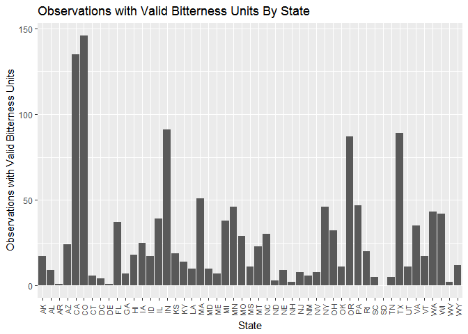
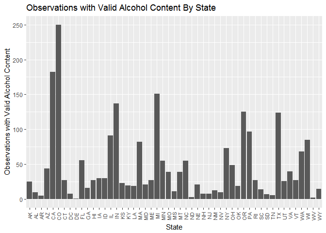
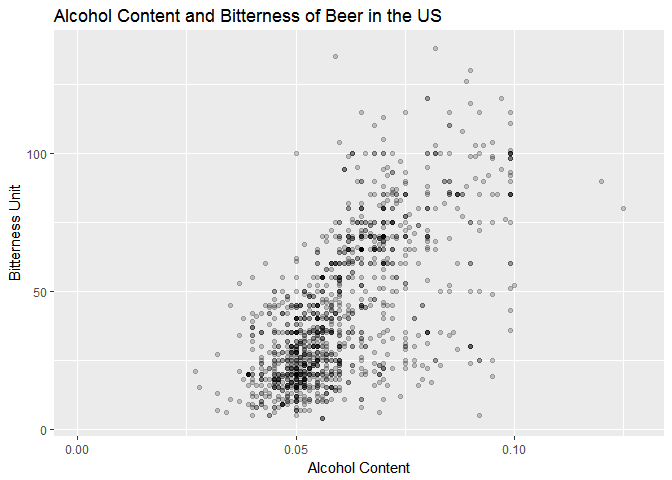

# An Analysis of the Beers and Breweries Data Sets
Paul Panek  
July 1, 2017  


# Introduction

The purpose of this article is to provide an analysis of the "Beers" and "Breweries" Data Sets. 

The Breweries data set provides information on craft breweries including their name as well as the city and state in which they are located.  

The Beers Data Set provides:  
a) the Name of the beers 
b) the brewery in which they are produced,
c) the style of beer,
d) the size of the container in ounces,
e) the alcohol content by volume, and
f) a measure of Bitterness of the beer (International Bitterness Unit)

The two files are linked by an ID.

In combination, this data describes where Craft Beer production, in terms of the number of breweries and "labels", is concentrated by city and state, and provides some perspective on the alcohol content and  bitterness of the beer produced.  Not all of these dimensions are described in this article.

It may also be worthwhile to note some limitations of the data.  It is not known how these breweries were selected.  The breweries appear to be "Craft Breweries", and their proportion of the Craft or overall beer market is not known.  The statistics reported here representing alcohol content and bitterness are measured by the number of "labels" produced in each  state, not on the volume of their production or consumption in that state.
 
The time periods represented by the data are also not known.  Ten states are not represented.  It is unclear if that is because these states did not have any breweries that met the criteria for this study, of if it is a limitation of the data gathering process.

While the data is relatively clean, there are a few items to note:

1)  There were no duplicate records.

2)  The number of Breweries should probably be adjusted due to identical Brewery Names having multiple
    records:
    a) Spelling errors in the name of their city (2 cases).  Correction would reduce the number of
      breweries by 2.
    b) 1 Case where the the same brewery in the same city is shown in two different states (MA and MI).
      Correction would reduce the number of Breweries by 1.
    c) Four cases where the same Brewery Name is shown is shown in two different cities.  Resolution
      is not certain.
      
3)  There are six cases where pairs of Brewery Names are suspiciously close to each other, but not exactly the same.  
    Two were not duplicates because they were in different states.
    In one case I would call the duplication certain, and in the other three extremely likely.

Because the Breweries data set contains 558 observations and the number of adjustments that are clearly wrong is so small, I did not change the data.  It would not meaningfully change the results. Changing the data would not have changed the number of observations of different beers produced.

Some of what the data can tell us is set forth below.  The commented code used to create the R Objects and review the data for "cleanliness", along with commented code, are shown in the Appendix at the end of this document.  (For a real article I would turn the Echo off, but I know you want to see the code.)

# What Does the Data Tell Us?


```r
############################################################################################
#  General Section
############################################################################################
setwd("C:\\Users\\X\\Documents\\SMU\\DoingDataScience\\PPanek_CaseStudy1\\Analysis")
library(tidyr)
library(dplyr)
```

```
## Warning: Installed Rcpp (0.12.10) different from Rcpp used to build dplyr (0.12.11).
## Please reinstall dplyr to avoid random crashes or undefined behavior.
```

```
## 
## Attaching package: 'dplyr'
```

```
## The following objects are masked from 'package:stats':
## 
##     filter, lag
```

```
## The following objects are masked from 'package:base':
## 
##     intersect, setdiff, setequal, union
```

```r
library(ggplot2)

# Data-Reading and Creating the Merged File So the Data_Manipulation_Script does not need to be run.
#########################################################################################################

# Reading Data
Beers <- read.csv("Data\\Beers.csv",header=TRUE)
Breweries <- read.csv("Data\\Breweries.csv",header=TRUE)
# Preserving Original Data Tables
BeersOriginal <- Beers
BreweriesOriginal <- Breweries
# Renaming
Breweries<-rename(BreweriesOriginal,BreweryName=Name,Brewery_ID=Brew_ID)
Beers<-rename(BeersOriginal,BeerName=Name,AlcoholbyVolume=ABV,BitternessUnit=IBU,Brewery_ID=Brewery_id)
# Merging
BeerMerged1 <- merge(Beers,Breweries, by = "Brewery_ID", all = TRUE)
head(BeerMerged1)  # Check Merge, Looks OK
```

```
##   Brewery_ID      BeerName Beer_ID AlcoholbyVolume BitternessUnit
## 1          1  Get Together    2692           0.045             50
## 2          1 Maggie's Leap    2691           0.049             26
## 3          1    Wall's End    2690           0.048             19
## 4          1       Pumpion    2689           0.060             38
## 5          1    Stronghold    2688           0.060             25
## 6          1   Parapet ESB    2687           0.056             47
##                                 Style Ounces        BreweryName
## 1                        American IPA     16 NorthGate Brewing 
## 2                  Milk / Sweet Stout     16 NorthGate Brewing 
## 3                   English Brown Ale     16 NorthGate Brewing 
## 4                         Pumpkin Ale     16 NorthGate Brewing 
## 5                     American Porter     16 NorthGate Brewing 
## 6 Extra Special / Strong Bitter (ESB)     16 NorthGate Brewing 
##          City State
## 1 Minneapolis    MN
## 2 Minneapolis    MN
## 3 Minneapolis    MN
## 4 Minneapolis    MN
## 5 Minneapolis    MN
## 6 Minneapolis    MN
```

## Item 1:   How Many Breweries in each state?

```r
table(Breweries$State)
```

```
## 
##  AK  AL  AR  AZ  CA  CO  CT  DC  DE  FL  GA  HI  IA  ID  IL  IN  KS  KY 
##   7   3   2  11  39  47   8   1   2  15   7   4   5   5  18  22   3   4 
##  LA  MA  MD  ME  MI  MN  MO  MS  MT  NC  ND  NE  NH  NJ  NM  NV  NY  OH 
##   5  23   7   9  32  12   9   2   9  19   1   5   3   3   4   2  16  15 
##  OK  OR  PA  RI  SC  SD  TN  TX  UT  VA  VT  WA  WI  WV  WY 
##   6  29  25   5   4   1   3  28   4  16  10  23  20   1   4
```

```r
ggplot(Breweries,aes(factor(Breweries$State)))+geom_bar()+labs(x="State",title="Number of Breweries by State")+theme(axis.text.x  = element_text(angle=90, vjust=0.5, size=8))
```

<!-- -->

The number of Breweries in each state where there are breweries can be seen in the table above.
The number ranges from 1 (DC, ND, SD and WV) to 47 in CO.  There are 51 observations, including DC,
so 10 states are not represented, or have no Breweries.


## Item 2:   Merge the two files and Print the Head and Tail
Note, the file was merged earlier in the code.

```r
head(BeerMerged1)
```

```
##   Brewery_ID      BeerName Beer_ID AlcoholbyVolume BitternessUnit
## 1          1  Get Together    2692           0.045             50
## 2          1 Maggie's Leap    2691           0.049             26
## 3          1    Wall's End    2690           0.048             19
## 4          1       Pumpion    2689           0.060             38
## 5          1    Stronghold    2688           0.060             25
## 6          1   Parapet ESB    2687           0.056             47
##                                 Style Ounces        BreweryName
## 1                        American IPA     16 NorthGate Brewing 
## 2                  Milk / Sweet Stout     16 NorthGate Brewing 
## 3                   English Brown Ale     16 NorthGate Brewing 
## 4                         Pumpkin Ale     16 NorthGate Brewing 
## 5                     American Porter     16 NorthGate Brewing 
## 6 Extra Special / Strong Bitter (ESB)     16 NorthGate Brewing 
##          City State
## 1 Minneapolis    MN
## 2 Minneapolis    MN
## 3 Minneapolis    MN
## 4 Minneapolis    MN
## 5 Minneapolis    MN
## 6 Minneapolis    MN
```

```r
tail(BeerMerged1)
```

```
##      Brewery_ID                  BeerName Beer_ID AlcoholbyVolume
## 2405        556             Pilsner Ukiah      98           0.055
## 2406        557  Heinnieweisse Weissebier      52           0.049
## 2407        557           Snapperhead IPA      51           0.068
## 2408        557         Moo Thunder Stout      50           0.049
## 2409        557         Porkslap Pale Ale      49           0.043
## 2410        558 Urban Wilderness Pale Ale      30           0.049
##      BitternessUnit                   Style Ounces
## 2405             NA         German Pilsener     12
## 2406             NA              Hefeweizen     12
## 2407             NA            American IPA     12
## 2408             NA      Milk / Sweet Stout     12
## 2409             NA American Pale Ale (APA)     12
## 2410             NA        English Pale Ale     12
##                        BreweryName          City State
## 2405         Ukiah Brewing Company         Ukiah    CA
## 2406       Butternuts Beer and Ale Garrattsville    NY
## 2407       Butternuts Beer and Ale Garrattsville    NY
## 2408       Butternuts Beer and Ale Garrattsville    NY
## 2409       Butternuts Beer and Ale Garrattsville    NY
## 2410 Sleeping Lady Brewing Company     Anchorage    AK
```
Both ends of the data look reasonable, but a lot of visible observations have NA for BitternessUnit.
This is born out when we look at the entire data set below.

## Item 3:   The Number of NAs in each Column

```r
apply(BeerMerged1, 2, function(x) {sum(is.na(x))})
```

```
##      Brewery_ID        BeerName         Beer_ID AlcoholbyVolume 
##               0               0               0              62 
##  BitternessUnit           Style          Ounces     BreweryName 
##            1005               0               0               0 
##            City           State 
##               0               0
```
There are 62 NAS in Alocohol by Volume, and 1,005 in Bitterness Unit out of 2,410 observations.


## Item 4:   Median Alcohol Content and Bitteness by State

The medians of Alcohol Content and Beer Bitteness by State can tell us something about the variability of these characteristics between states.

I have removed the observations that have NA for the relevant variable.  There may be other ways of treating this, but I wanted to see, and provide, the results of unadulturated data.


```r
# Creating a Data frame for the values to plot.  I know this was inefficient, but had to stop with the research and use brute force.
Bitmedians<-tapply(BeerMerged1$BitternessUnit,BeerMerged1$State,median,na.rm = TRUE)
AlcMedians<-tapply(BeerMerged1$AlcoholbyVolume,BeerMerged1$State,median,na.rm = TRUE)
Statelist<-c("AK","AL","AR","AZ","CA","CO","CT","DC","DE","FL","GA","HI","IA","ID","IL","IN","KS","KY","LA","MA","MD","ME","MI","MN","MO","MS","MT","NC","ND","NE","NH","NJ","NM","NV","NY","OH","OK","OR","PA","RI","SC","SD","TN","TX","UT","VA","VT","WA","WI","WV","WY")
#  I understand the risk of doing it this way, and inspected the results to make sure that Statelist values lined up with the row names.
StateMedians<-data.frame(Bitmedians,AlcMedians,Statelist)
names(StateMedians)<-c("Bitmedians","AlcMedians","State")

ggplot(StateMedians,aes(x=StateMedians$State, y=StateMedians$AlcMedians))+geom_bar(stat = "identity")+labs(x="State", y="Median Alcohol Content by Volume",title = "Median Beer Alcohol Content By State")+theme(axis.text.x  = element_text(angle=90, vjust=0.5, size=8))
```

<!-- -->

Median Alcohol Content is relatively stable accross States. 


```r
ggplot(StateMedians,aes(x=StateMedians$State, y=StateMedians$Bitmedians))+geom_bar(stat = "identity")+labs(x="State", y="Median Int'l Bitterness Units",title = "Median Beer Bitterness By State")+theme(axis.text.x  = element_text(angle=90, vjust=0.5, size=8))
```

```
## Warning: Removed 1 rows containing missing values (position_stack).
```

<!-- -->

There is a fair amount of variation in the Median Bitterness Unit by State, with the highest median approximately 3X the lowest.

The high number of "NA" values in Bitterness may be contributing to the volatility of the statistic.  The graphs below show the number of observations contained in the calculation of the Medians. 

```r
# Getting number of Not NA observations to evaluate quality of Medians
AlcoholByStateNotNA <- tapply(BeerMerged1$AlcoholbyVolume,BeerMerged1$State,function(x) {sum(!is.na(x))})
BitterByStateNotNA <- tapply(BeerMerged1$BitternessUnit,BeerMerged1$State,function(x) {sum(!is.na(x))})
NotNAByState <- data.frame(BitterByStateNotNA,AlcoholByStateNotNA,Statelist)
names(NotNAByState)<-c("NotNABit","NotNAAlc","State")
ggplot(NotNAByState,aes(x=NotNAByState$State, y=NotNAByState$NotNABit))+geom_bar(stat = "identity")+labs(x="State", y="Observations with Valid Bitterness Units",title = "Observations with Valid Bitterness Units By State")+theme(axis.text.x  = element_text(angle=90, vjust=0.5, size=8))
```

<!-- -->

```r
ggplot(NotNAByState,aes(x=NotNAByState$State, y=NotNAByState$NotNAAlc))+geom_bar(stat = "identity")+labs(x="State", y="Observations with Valid Alcohol Content",title = "Observations with Valid Alcohol Content By State")+theme(axis.text.x  = element_text(angle=90, vjust=0.5, size=8))
```

<!-- -->
As can be seen from the graphs above, the number of observations contained in the medians in certain states is quite small, which may affect how the data is interpreted.


## Item 5:   States where the beer with the highest alcohol content and the most bitter beer are brewed.

```r
BeerMerged1[which(BeerMerged1$AlcoholbyVolume == max(BeerMerged1$AlcoholbyVolume, na.rm = TRUE)),10]
```

```
## [1]  CO
## 51 Levels:  AK  AL  AR  AZ  CA  CO  CT  DC  DE  FL  GA  HI  IA  ID ...  WY
```
The beer with the highest Alcohol Content is brewed in CO.


```r
BeerMerged1[which(BeerMerged1$BitternessUnit == max(BeerMerged1$BitternessUnit, na.rm = TRUE)),10]
```

```
## [1]  OR
## 51 Levels:  AK  AL  AR  AZ  CA  CO  CT  DC  DE  FL  GA  HI  IA  ID ...  WY
```
The beer with the highest Bitterness is brewed in OR.

## Item 6:   Summary Statistics for Alcohol by Volume

```r
summary(BeerMerged1$AlcoholbyVolume)
```

```
##    Min. 1st Qu.  Median    Mean 3rd Qu.    Max.    NA's 
## 0.00100 0.05000 0.05600 0.05977 0.06700 0.12800      62
```
Alcohol content ranges from .1% to 12.8% with a mean of 5.977% and a Median of 5.6%.  The data appears slightly right-skewed.


## Item 7:   Relationship between Bitterness and Alcoholic Content

```r
ggplot(BeerMerged1,aes(BeerMerged1$AlcoholbyVolume,BeerMerged1$BitternessUnit))+geom_point(alpha=1/5)+labs(x="Alcohol Content", y="Bitterness Unit",title = "Alcohol Content and Bitterness of Beer in the US")
```

```
## Warning: Removed 1005 rows containing missing values (geom_point).
```

<!-- -->

There appears to be a positive correlation between Alcohol Content and Bitterness.  The nature of the relationship appears to change above approximately 6% Alcohol Content.  More clarity could be gained into this relationship by looking at the data by the Style of beer, whis is a factor in the data set.


# Conclusion

The statistics reviewed reveal a lot of variability in the number of breweries by state, and a likely weak but positive non-linear positive relationship between Alcoholic Content and Bitterness.  There is a also greater variability in median Bitterness of beer produced in each state than there is in the median Alcohol Content.  Because sample sizes are inconsistent across states, and in some cases are very small, the user should draw their conclusions with caution and consider ways to mitigate.

The Beers and Breweries data sets are relatively clean, and can provide some interesting insights into the Craft Beer industry.

Dimensions for exploration include:
a) Geographic concentrations, City and States
b) Alcohol content
c) Bitterness
d) Number of labels
e) Style of Beer
f) Container Size and
g) Patterns in Label and Brewery Names
h) Labels(Different Beer) per Brewery.

Additional interesting analyses could be peformed if combined with demographic data by city or state.

It is important to note that the time frame covered by the data is not known, nor is the volume of beer produced, so weighting of the individual records by a measure of importance is not possible with these data sets alone.


# APPENDIX:

## Part 1- Reading and Merging the Data
This section sets forth the process of reading the files, analyzing the data for suitability for Analysis and creating a merged data file.  The name of the final data.frame is BeerMerged1.

### Reading and Initially Reviewing the Data


```r
# General
setwd("C:\\Users\\X\\Documents\\SMU\\DoingDataScience\\PPanek_CaseStudy1\\Analysis")
library(tidyr)
library(dplyr)
library(ggplot2)

# Reading Data
Beers <- read.csv("Data\\Beers.csv",header=TRUE)
Breweries <- read.csv("Data\\Breweries.csv",header=TRUE)

# Preserving Original Data Tables
BeersOriginal <- Beers
BreweriesOriginal <- Breweries

# First Review of Data
head(BeersOriginal)
```

```
##                  Name Beer_ID   ABV IBU Brewery_id
## 1            Pub Beer    1436 0.050  NA        409
## 2         Devil's Cup    2265 0.066  NA        178
## 3 Rise of the Phoenix    2264 0.071  NA        178
## 4            Sinister    2263 0.090  NA        178
## 5       Sex and Candy    2262 0.075  NA        178
## 6        Black Exodus    2261 0.077  NA        178
##                            Style Ounces
## 1            American Pale Lager     12
## 2        American Pale Ale (APA)     12
## 3                   American IPA     12
## 4 American Double / Imperial IPA     12
## 5                   American IPA     12
## 6                  Oatmeal Stout     12
```

```r
# Data appears clean
# ABV and IBU variables are not intuitive and should be renamed
# NA values for IBU
# Otherwise the Data appear clean

dim(BeersOriginal)
```

```
## [1] 2410    7
```

```r
# 2,410 rows and 7 columns

summary(BeersOriginal)
```

```
##                      Name         Beer_ID            ABV         
##  Nonstop Hef Hop       :  12   Min.   :   1.0   Min.   :0.00100  
##  Dale's Pale Ale       :   6   1st Qu.: 808.2   1st Qu.:0.05000  
##  Oktoberfest           :   6   Median :1453.5   Median :0.05600  
##  Longboard Island Lager:   4   Mean   :1431.1   Mean   :0.05977  
##  1327 Pod's ESB        :   3   3rd Qu.:2075.8   3rd Qu.:0.06700  
##  Boston Lager          :   3   Max.   :2692.0   Max.   :0.12800  
##  (Other)               :2376                    NA's   :62       
##       IBU           Brewery_id                               Style     
##  Min.   :  4.00   Min.   :  1.0   American IPA                  : 424  
##  1st Qu.: 21.00   1st Qu.: 94.0   American Pale Ale (APA)       : 245  
##  Median : 35.00   Median :206.0   American Amber / Red Ale      : 133  
##  Mean   : 42.71   Mean   :232.7   American Blonde Ale           : 108  
##  3rd Qu.: 64.00   3rd Qu.:367.0   American Double / Imperial IPA: 105  
##  Max.   :138.00   Max.   :558.0   American Pale Wheat Ale       :  97  
##  NA's   :1005                     (Other)                       :1298  
##      Ounces     
##  Min.   : 8.40  
##  1st Qu.:12.00  
##  Median :12.00  
##  Mean   :13.59  
##  3rd Qu.:16.00  
##  Max.   :32.00  
## 
```

```r
# Names appear multiple times - Possible duplicate records
# 62 NAs in ABV and 1005 in IBU.  Significant for IBU.

str(BeersOriginal)
```

```
## 'data.frame':	2410 obs. of  7 variables:
##  $ Name      : Factor w/ 2305 levels "#001 Golden Amber Lager",..: 1638 577 1705 1842 1819 268 1160 758 1093 486 ...
##  $ Beer_ID   : int  1436 2265 2264 2263 2262 2261 2260 2259 2258 2131 ...
##  $ ABV       : num  0.05 0.066 0.071 0.09 0.075 0.077 0.045 0.065 0.055 0.086 ...
##  $ IBU       : int  NA NA NA NA NA NA NA NA NA NA ...
##  $ Brewery_id: int  409 178 178 178 178 178 178 178 178 178 ...
##  $ Style     : Factor w/ 100 levels "","Abbey Single Ale",..: 19 18 16 12 16 80 18 22 18 12 ...
##  $ Ounces    : num  12 12 12 12 12 12 12 12 12 12 ...
```

```r
# First Name starts with "#001" which is a Potential error.  Should sort by name and look for issues if data is used.
# Should Re-Name Name variable to reduce potential ambiguity.

head(BreweriesOriginal)
```

```
##   Brew_ID                      Name          City State
## 1       1        NorthGate Brewing    Minneapolis    MN
## 2       2 Against the Grain Brewery    Louisville    KY
## 3       3  Jack's Abby Craft Lagers    Framingham    MA
## 4       4 Mike Hess Brewing Company     San Diego    CA
## 5       5   Fort Point Beer Company San Francisco    CA
## 6       6     COAST Brewing Company    Charleston    SC
```

```r
# Data looks good, but should rename the Name Variable, and the Brew_ID variable.

dim(BreweriesOriginal)
```

```
## [1] 558   4
```

```r
# 558 rows and four columns

summary(BreweriesOriginal)
```

```
##     Brew_ID                           Name           City    
##  Min.   :  1.0   Blackrocks Brewery     :  2   Portland: 17  
##  1st Qu.:140.2   Blue Mountain Brewery  :  2   Boulder :  9  
##  Median :279.5   Lucette Brewing Company:  2   Chicago :  9  
##  Mean   :279.5   Oskar Blues Brewery    :  2   Seattle :  9  
##  3rd Qu.:418.8   Otter Creek Brewing    :  2   Austin  :  8  
##  Max.   :558.0   Sly Fox Brewing Company:  2   Denver  :  8  
##                  (Other)                :546   (Other) :498  
##      State    
##   CO    : 47  
##   CA    : 39  
##   MI    : 32  
##   OR    : 29  
##   TX    : 28  
##   PA    : 25  
##  (Other):358
```

```r
# Certain Breweries appear more than Once.  Possible Duplicates.  May not be if in different Cities or States.
# Should rename Brew_ID so it matches Brewery_ID in Beers (at least for Merge).  Brewery_ID is more descriptive.

str(BreweriesOriginal)
```

```
## 'data.frame':	558 obs. of  4 variables:
##  $ Brew_ID: int  1 2 3 4 5 6 7 8 9 10 ...
##  $ Name   : Factor w/ 551 levels "10 Barrel Brewing Company",..: 355 12 266 319 201 136 227 477 59 491 ...
##  $ City   : Factor w/ 384 levels "Abingdon","Abita Springs",..: 228 200 122 299 300 62 91 48 152 136 ...
##  $ State  : Factor w/ 51 levels " AK"," AL"," AR",..: 24 18 20 5 5 41 6 23 23 23 ...
```

```r
# 551 levels of Brewery Names, so seven duplicates.  Need to review.
# No NAs.
```
#  Looking for issues with the Data and Merging the Files

```r
#  Checking for Duplicate Records
Breweries[duplicated(BreweriesOriginal),]
```

```
## [1] Brew_ID Name    City    State  
## <0 rows> (or 0-length row.names)
```

```r
Beers[duplicated(BeersOriginal),]
```

```
## [1] Name       Beer_ID    ABV        IBU        Brewery_id Style     
## [7] Ounces    
## <0 rows> (or 0-length row.names)
```

```r
#  None in either file.

# Renaming Variables
Breweries<-rename(BreweriesOriginal,BreweryName=Name,Brewery_ID=Brew_ID)
Beers<-rename(BeersOriginal,BeerName=Name,AlcoholbyVolume=ABV,BitternessUnit=IBU,Brewery_ID=Brewery_id)
# Making the names more descriptive and matching the Variable to Merge on.
# Old name of Brew_Id could be ambiguous since some folks call Beers "Brews".

# Checking to see that the Name Change worked as expected.
head(Beers)
```

```
##              BeerName Beer_ID AlcoholbyVolume BitternessUnit Brewery_ID
## 1            Pub Beer    1436           0.050             NA        409
## 2         Devil's Cup    2265           0.066             NA        178
## 3 Rise of the Phoenix    2264           0.071             NA        178
## 4            Sinister    2263           0.090             NA        178
## 5       Sex and Candy    2262           0.075             NA        178
## 6        Black Exodus    2261           0.077             NA        178
##                            Style Ounces
## 1            American Pale Lager     12
## 2        American Pale Ale (APA)     12
## 3                   American IPA     12
## 4 American Double / Imperial IPA     12
## 5                   American IPA     12
## 6                  Oatmeal Stout     12
```

```r
head(Breweries)
```

```
##   Brewery_ID               BreweryName          City State
## 1          1        NorthGate Brewing    Minneapolis    MN
## 2          2 Against the Grain Brewery    Louisville    KY
## 3          3  Jack's Abby Craft Lagers    Framingham    MA
## 4          4 Mike Hess Brewing Company     San Diego    CA
## 5          5   Fort Point Beer Company San Francisco    CA
## 6          6     COAST Brewing Company    Charleston    SC
```

```r
# Merging the files
BeerMerged1 <- merge(Beers,Breweries, by = "Brewery_ID", all = TRUE)
head(BeerMerged1)  # Check Merge, Looks OK
```

```
##   Brewery_ID      BeerName Beer_ID AlcoholbyVolume BitternessUnit
## 1          1  Get Together    2692           0.045             50
## 2          1 Maggie's Leap    2691           0.049             26
## 3          1    Wall's End    2690           0.048             19
## 4          1       Pumpion    2689           0.060             38
## 5          1    Stronghold    2688           0.060             25
## 6          1   Parapet ESB    2687           0.056             47
##                                 Style Ounces        BreweryName
## 1                        American IPA     16 NorthGate Brewing 
## 2                  Milk / Sweet Stout     16 NorthGate Brewing 
## 3                   English Brown Ale     16 NorthGate Brewing 
## 4                         Pumpkin Ale     16 NorthGate Brewing 
## 5                     American Porter     16 NorthGate Brewing 
## 6 Extra Special / Strong Bitter (ESB)     16 NorthGate Brewing 
##          City State
## 1 Minneapolis    MN
## 2 Minneapolis    MN
## 3 Minneapolis    MN
## 4 Minneapolis    MN
## 5 Minneapolis    MN
## 6 Minneapolis    MN
```


# Checking for Brewery Names with multiple Brewery IDs

```r
BreweriesOriginal$Name[which(duplicated(BreweriesOriginal$Name) == TRUE)]
```

```
## [1] Blackrocks Brewery      Summit Brewing Company  Otter Creek Brewing    
## [4] Sly Fox Brewing Company Blue Mountain Brewery   Lucette Brewing Company
## [7] Oskar Blues Brewery    
## 551 Levels: 10 Barrel Brewing Company ... Wynkoop Brewing Company
```

```r
# Seven potential duplicates.  Will need to evaluate the merged file to see how they are used.
# If truly duplicate and meaningful to the results will need to eliminate the records in
# Breweries and change the Brewery ID in Beers.
```

The process I used to look at these duplicates is somewhat long and is potentially distracting. Because I opted not to adjust any of the data, I have saved that code in a separate file, Dupe_Breweries.

The process consisted of three steps:
  1) Looking at the Breweries File to see why they were shown as duplicates, and to get the Brewery IDs.
  2) Looking at the Merged file to see how ofthen the relevant IDs were used.
  3) Deciding what to do.  
  
In the end, only in one case was the state affected, and I was reasonably certain that the number of breweries should be reduced by five.  In two additional cases it is possible that the number of breweries should be reduced by 1.

I also performed a visual inspection of Brewery Names to see if there were some that were not duplicates but could be. The command used was sort(BreweriesOriginal$Name).  I have not included it as a code chunk because I didn't want to take up the space with the output.

The Visual inspection yielded the following results to focus on:

Against the Grain Brewery & Against The Grain Brewery - Looks like a Typo in the Name

Angry Minnow & Angry Minnow Brewing Company - Are Probably the same

Goose Island Brewery Company & Goose Island Brewing Company - Are Probably the Same

Hops & Grain Brewery & Hops & Grains Brewing Company - Are Probably the Same

Mother Earth Brew Company & Mother Earth Brewing Company - These are OK, they are in Different States  

Oskar Blues Brewery - Oskar Blues Brewery (North Carol...  These are OK, they are in Different States

The code to evaluate these is in Dupe_Breweries if Interested.

Because the number of brewery records is overstated (due to similar but not identical names) by either one or four depending on the desired level of certainty, I opted not to change the data.
